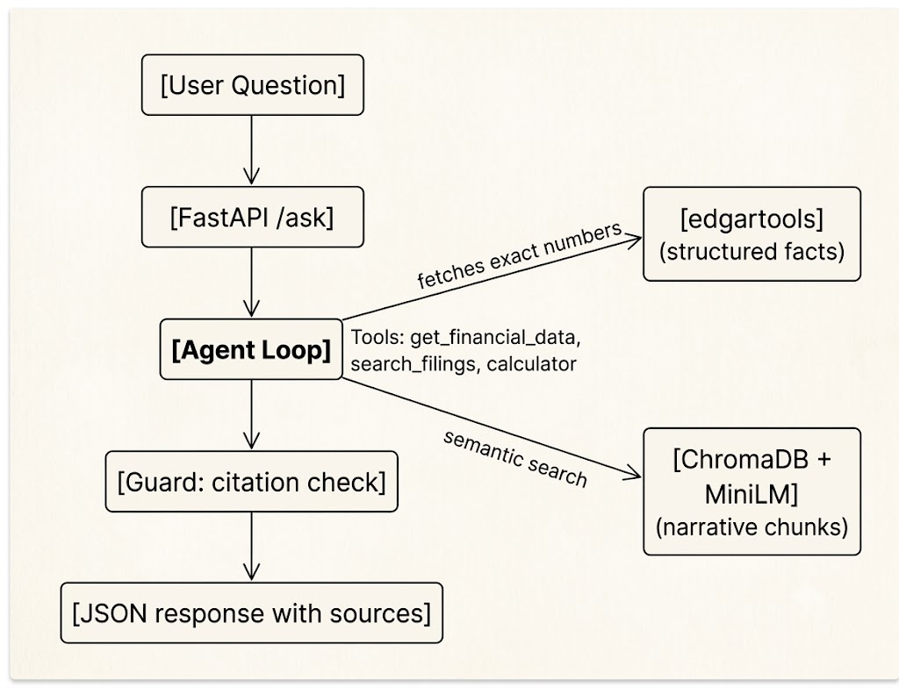

# CompanyScope

An AI that reads SEC filings and answers financial questions with exact sources.  
No made-up numbers. No speculation. Just citations from the data it actually sees.


## What it does

You ask a question like "How much did Apple make in 2025?" and the system:

- pulls the exact figure from EDGAR (via `edgartools`)
- if you ask about strategy or risks, it searches the narrative sections of 10-K/10-Q filings
- can do simple math when you need things like growth rates
- returns an answer with citations: for numbers, the concept and period; for text, a direct quote from the filing
- if the answer isn't there, it tells you that instead of guessing

It's not a chatbot that remembers history or gives investment advice. It's a tool that tries to be honest about what it can and can't verify.

## Architecture


The system splits the problem into two parts:

- **Structured facts** (revenue, assets, EPS) come from `edgartools` directly — no parsing tables, no vector search.
- **Narrative text** (MD&A, risk factors, earnings calls) is chunked, embedded with `all-MiniLM-L6-v2`, and stored in a local ChromaDB vector database.

When you ask a question, an agent loop decides which tools to call: fetch a number, search filings, or run the calculator. The LLM (Groq's Llama 3.3 70B, free tier) orchestrates the tools and returns a JSON answer. After that, a guard function checks every citation: if a quoted string doesn't actually appear in the source chunk, the answer is rejected or replaced with an honest "I couldn't verify this."

## Why this project stands out

Most "financial AI" projects call an LLM and hope for the best. This one:

- Never asks the LLM to do math - it uses a real `calculator` function.
- Never trusts the LLM to remember a number - it fetches it from the actual SEC filing.
- Checks its own work - citations are verified with string matches.
- Has an evaluation suite that runs automatically on every push and breaks the build if accuracy drops.
- Uses an agent loop to decide when to fetch numbers, search text, or ask for clarification - not just a one-shot retrieval pipeline.

## Tech stack

- Python 3.11, FastAPI, Uvicorn
- Groq API (free tier) for LLM inference
- ChromaDB (embedded mode) for vector search
- `sentence-transformers` (MiniLM) for embeddings
- `edgartools` for structured financial data
- Streamlit for the demo UI
- GitHub Actions for CI (runs eval, linting, type checks)

Not yet included: Docker, Langfuse observability. Those are on the todo list.

## Quickstart

### 1. Clone and set up environment
```bash
git clone https://github.com/yourusername/company-scope.git
cd company-scope
uv sync
```

### 2. Get a free Groq API key
From [console.groq.com](https://console.groq.com) (no credit card required). Put it in a `.env` file:

```
GROQ_API_KEY=gsk_your_key_here
```

### 3. Ingest filings (one-time setup)
```bash
python src/ingest.py
```
This downloads Apple's last few 10-Ks and 10-Qs, extracts the narrative sections, and builds the vector index (ChromaDB folder). Takes about a minute on a normal laptop.

### 4. Start the API
```bash
uvicorn src.app:app --reload
```

### 5. Try it
```bash
curl -X POST http://localhost:8000/ask \
  -H "Content-Type: application/json" \
  -d '{"question":"What was Apple revenue in 2023?", "ticker":"AAPL"}'
```

Or play with the UI:
```bash
streamlit run streamlit_app.py
```

## Evaluation and CI

I wrote a set of 30 test cases in `tests/eval_data.yaml` that cover:

- Straight number lookups (e.g., "net income 2022")
- Narrative questions (e.g., "what does Apple say about supply chain risks")
- Computation questions (e.g., "revenue growth from 2022 to 2023")
- Trick questions where the answer isn't in the filings
- Ambiguous questions where the system should ask for clarification

The CI pipeline (`.github/workflows/ai-ci.yml`) starts the API, runs all tests, and fails if factual accuracy drops below 95% or refusal accuracy drops below 90%. This catches regressions from prompt changes or code updates before they reach anyone.


## Project layout

```
company-scope/
├── src/
│   ├── ingest.py          # Download filings, clean text, chunk
│   ├── embed.py           # Embed chunks, store in ChromaDB
│   ├── tools.py           # get_financial_data, search_filings, calculator
│   ├── agent.py           # Agent loop with Groq function calling
│   ├── guard.py           # Citation verification
│   └── app.py             # FastAPI endpoint
├── tests/
│   ├── eval_data.yaml     # Curated evaluation questions
│   └── test_eval.py       # Automated tests
├── prompts/system.txt     # The system prompt (versioned)
├── streamlit_app.py       # Demo interface
├── .github/workflows/     # CI pipeline
└── README.md
```

## What I learned building this

- **You can't just chunk everything together**. Mixing tables and text ruins retrieval. I kept financial facts in a separate pipeline and only vectorized narrative sections.
- **An agent loop beats a static RAG chain** for real questions. Users don't ask only "what is X" - they ask "compare X and Y and tell me if management saw it coming". That needs multiple tool calls.
- **Prompt engineering is software engineering**. The system prompt controls behavior, and a single word change can break refusal accuracy. That's why it's versioned and tested in CI.
- **Guards are not optional**. Even with strict prompts and tools, the LLM sometimes makes up a quote. A simple string match solves that very elegantly.
- **You don't need a GPU or a huge cloud budget**. Everything here runs on a 4-year-old laptop, using free APIs (though anything serious must still require paid APIs) and local models. The hard part is the system design, not the compute.
- **CI/CD is non-negotiable**. This is my first time working with Github Action. I did struggle for a while but it it absolutely a life saver when you actually maintain the project.

## Limitations and next steps
- Currently, I have not yet found a reliable source for scraping XBRL data of financial filings. I've tried `edgartools`'s built-in features but that destroyed the precious table data.
- Due to limited budget, I could only test the pipeline with Groq's free tier API. Waiting for your call Sam Altman xD
- Only tested with Apple filings so far. Expanding to other tickers is straightforward but needs more evaluation data and some UI redesign which I am terrible at.
- No streaming or multi-turn conversation - it's a single question/answer system on purpose.
- No Docker container yet. I'll add a docker-compose setup soon. I doubt that my Krabby Patty laptop can handle it though.
- No Langfuse traces. Right now I debug by looking at console output; proper observability would make that easier.
- I'm planning to migrate to WSL for better stability. There were many bugs caused by the fact that some libraries are not built with Windows in mind.
- Vietnamese Companies? Maybe. 
---

Built by Dang Quan 
```
